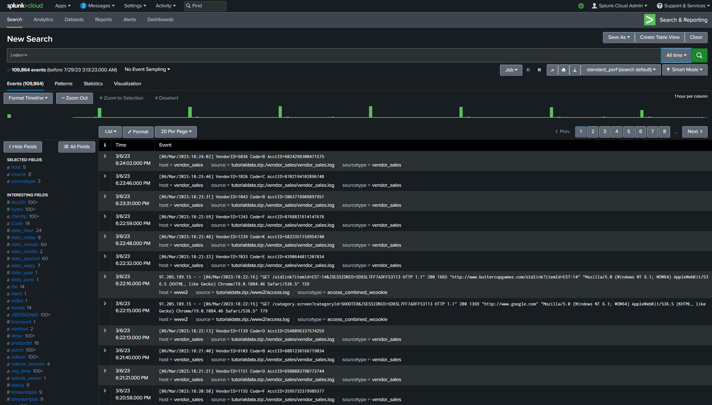
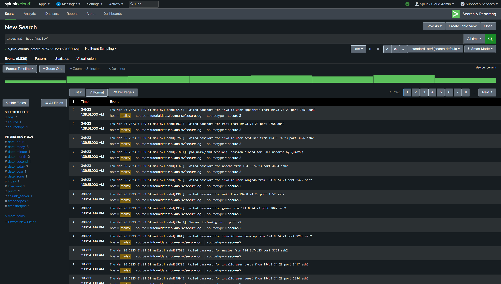
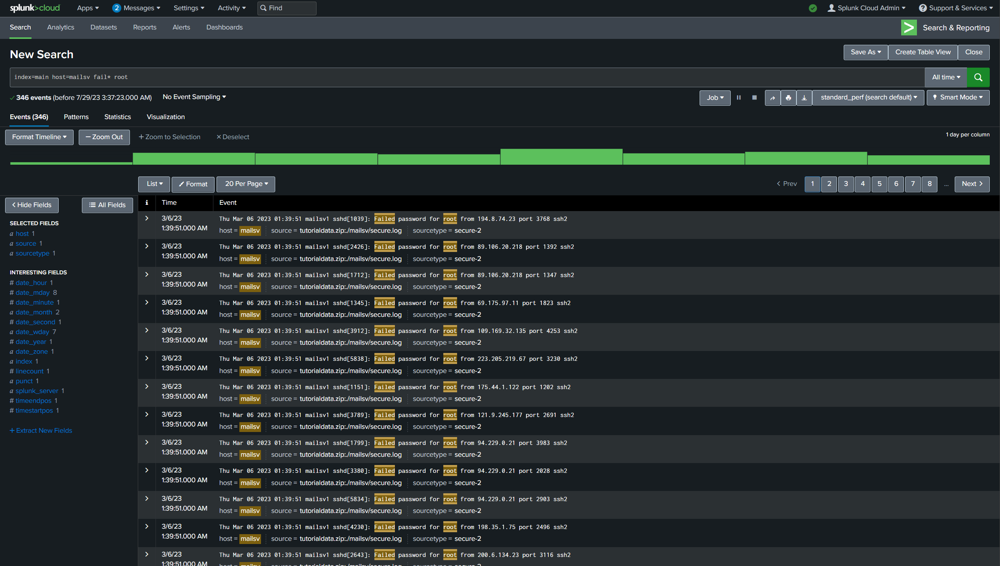

# Splunk Log Analysis
## **Background**
You are a security analyst working at the e-commerce store Buttercup Games. You've been tasked with identifying whether there are any possible security issues with the mail server. To do so, you must explore any failed SSH logins for the root account.  

When Splunk indexes data, it attaches fields to each event. These fields become part of the searchable index event data. This helps security analysts easily search for and find the specific data they need. Now that you've run your first query, examine the search results and the fields.

For each event, the fields are **host**, **source**, and **sourcetype**:
* **host**: The host field specifies the name of the network host from which the event originated. In this search there are five hosts:
  * **mailsv**: Buttercup Games' mail server. Examine events generated from this host.

  * **www1**: This is one of Buttercup Games' web applications.

  * **www2**: This is one of Buttercup Games' web applications.

  * **www3**:  This is one of Buttercup Games' web applications.

* **vendor_sales**: Information about Buttercup Games' retail sales.

* **source**: The source field indicates the file name from which the event originates. You should identify eight sources. Notice /mailsv/secure.log, which is a log file that contains information related to authentication and authorization attempts on the mail server.

* **sourcetype**: The sourcetype determines how data is formatted. You should observe three sourcetypes. Examine secure-2.

## **Logs**

_Log output for **index = \*** query_

_Log output for **index = \*, host= "mailsv"** query_

_Log output for **index = \*, host= "mailsv", fail* root** query_

## **Analysis** 
From the log output above, there are 346 failed login attemps with the failed password error. All failed attempts occurred at the same time indicating a brute force attack is likely to have occurred.