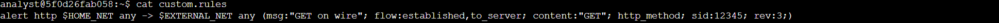
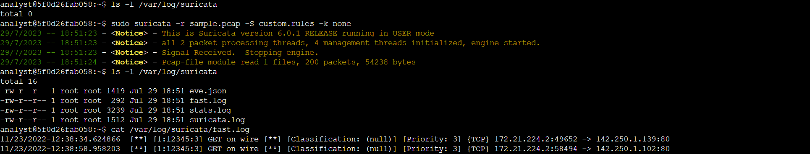
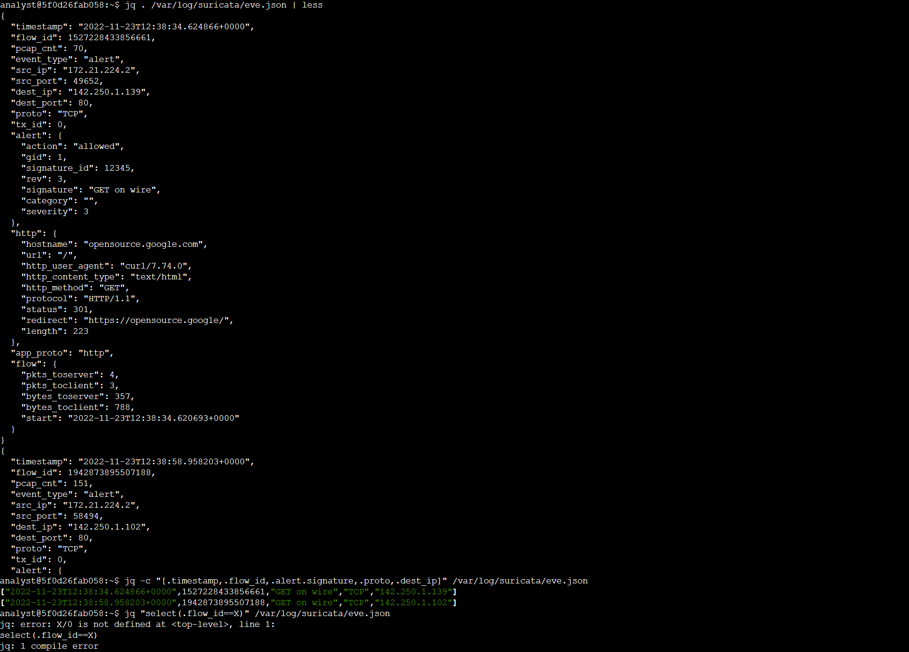

# Suricata Exploring Signatures Rules
## **Background**
In this lab activity, you'll explore the components of a rule using Suricata. You'll also have an opportunity to trigger a rule and examine the output in Suricata. You'll use the Bash shell to complete these steps. 

You have multiple tasks in this lab:
* Examine a rule in Suricata
* Trigger a rule and review the alert logs
* Examine **eve.json** outputs

## **Logs**

_Console output for signature rule_

_Console output for triggering a rule_

_Console output for the **eve.json** file_

## **Analysis**
The command returns the rule as the output in the shell:

__alert http $HOME_NET any -> $EXTERNAL_NET any (msg:"GET on wire"; flow:established,to_server; content:"GET"; http_method; sid:12345; rev:3;)__

This rule consists of three components: an action, a header, and rule options:
1. The action is the first part of the signature. It determines the action to take if all conditions are met.
2. The header defines the signature’s network traffic, which includes attributes such as protocols, source and destination IP addresses, source and destination ports, and traffic direction.
3. The rule option helps narrow down network traffic so you can find exactly what you’re looking for. 